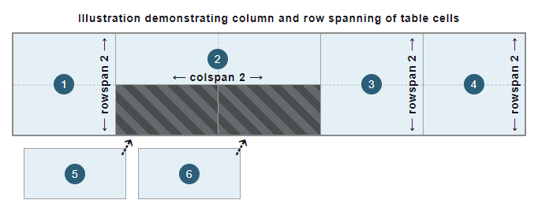

# HTML Elements for table

## table

### Description

Acts as a container for the table. All other elements should be within this container

### Attributes

Ony global attributes available

## td

### Description

Abbreviation for 'test data'. Represents a cell.

The <td> may only be used within a <tr> element.

### Attributes

- `colspan`: To specify how many columns the cell spans across. Similar to merge cell across columns.
- `rowspan`: To specify how many rows the cell spans across. Similar to merge cell across rows.
- `headers`: Contains a list of space-separated strings, each corresponding to the id attribute of the <th> elements that provide headings for this table cell. 

